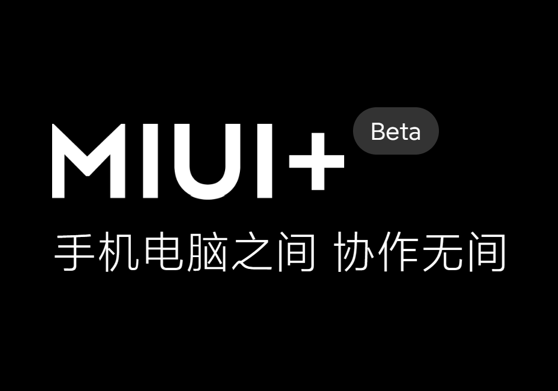

# （也许是）当代大学生需要知道的常用软件合集

## Part-1 文件管理和文件搜索

### 文件压缩与解压缩

没用过winRAR，跳过winRAR的介绍环节，没有贬低winRAR收费的意思:)

推荐两个我建议使用的压缩&解压缩软件：

#### 7-zip


- **官网链接：[7-Zip](https://www.7-zip.org/)**
- **适用平台：Windows**
- **详细介绍：[7-Zip详细安装教程 - 知乎 (zhihu.com)](https://zhuanlan.zhihu.com/p/472315250)**

一个简单轻便的解压软件，具体怎么解压轻便——整个软件都不到2MB了

除了UI有点古朴外没有影响，就讲究一个有口皆碑

#### bandizip


- **官网链接：[Bandizip](http://www.bandisoft.com/bandizip/dl/)**
- **适用平台：Windows, MacOS**
- **详细介绍：[[Bandzip-让你爱不释手的解压缩软件](https://zhuanlan.zhihu.com/p/65414066)](https://zhuanlan.zhihu.com/p/472315250)**

我本来是想大力夸赞bandizip的无私的，直到几年前大伙发现在7.0版本开始后bandisoft在bandizip的首页添加了广告（具体参考[别再推荐 bandzip 了！ - 知乎 (zhihu.com)](https://zhuanlan.zhihu.com/p/111170689)）。虽然后来体验一番后发现广告只出现在软件首页，而我一般使用都是只有解压窗口弹出来，具体使用没什么影响，但是心里有点膈应。


为什么顶着广告还要推荐bandizip呢？因为它适配的win11的右键菜单：


很神奇，这种小细节做得很好。

其次就是它的智能解压很符合我的使用习惯，用起来比较舒服。它唯一的问题是配置起来比较繁琐，所以我把我自己的设置导出了一份：

<a href="./README.files/Bandizip Settings - 2023年8月21日.reg">Bandizip Settings.reg</a>

先安装好bandizip（好像得是7.0版本往上），然后关掉程序，双击这个注册表文件，选择写入后再打开bandizip的主页，如果主题变成我设定的灰色就代表设置安装成功了

顺带一提，网上的莫名其妙的注册表文件别瞎安装，真的

### 文件搜索

#### Everything

如果你被Windows的**文件资源管理器自带的文件搜索**恶心过，那么，这个软件一定能解决你的问题

如果你没有被恶心过，现在打开文件资源管理器，选中C盘根目录，搜索msedge.exe，你就会理解为什么它恶心了


- **官网链接：[voidtools](https://www.voidtools.com/zh-cn/)**
- **适用平台：Windows**
- **详细介绍：[文件搜索神器 | Everything - 知乎 (zhihu.com)](https://zhuanlan.zhihu.com/p/409431144)**

简单来讲，这个软件提供的是文件搜索功能。在C盘根目录搜索msedge.exe转了几分钟都没反应，但是在everything里，一瞬间就出现了结果


被Windows文件搜索折磨的同学可以尝试

**（建议看完utools和wox的介绍再去下载，因为他们都有everything插件功能）**

在安装完软件之后，记得把自己用不到的文件夹（比如 Windows，AppData，ProgramData，ProgramFiles，Programfiles(x86)） 加入搜索黑名单

### 快速启动

如果你曾使用过Mac，知道Command+Space快捷键呼出的**聚焦搜索**功能，那么一定不会对下面这两款软件实现的功能感到陌生——它们都是模拟Mac的聚焦搜索功能推出的，并且都提供了不同的插件安装方式

换一种情况来说，如果你是一个Windows用户，经常用Windows键呼出的主菜单的搜索页面打开应用或寻找文件，那么我也建议你了解一下这几款应用

#### Wox


- **官网链接：[Wox](http://www.wox.one/)** 需通过Github下载本体，建议下载前先看看这个文件的 ***Part-2-3.-Github***
- **适用平台：Windows**
- **详细介绍：[效率神器 — WOX - 知乎 (zhihu.com)](https://zhuanlan.zhihu.com/p/68383315)**

介绍几个我比较喜欢这个软件的地方：


和电脑系统主题自适应的配色和自带的毛玻璃效果


对应的白色主题


也有毛玻璃感更强的主题，总结来说就是比较好看


特有的快速卸载应用插件


Steam游戏快速启动插件（这个utools也有）


以及强迫症最喜欢的每次开启自动回中

#### Utools


- **官网链接：[uTools官网 - 新一代效率工具平台](https://u.tools/)**
- **适用平台：Windows, MacOS, Linux**

- **详细介绍：[黑科技神器-uTools - 知乎 (zhihu.com)](https://zhuanlan.zhihu.com/p/113101989)**
- **介绍视频：[uTools的个人空间-uTools个人主页-哔哩哔哩视频 (bilibili.com)](https://space.bilibili.com/395978728)**

对的，这个是国产软件，拥有一些相当本地化的功能，有一些视频处理类插件需要付费，其他插件可以免费使用，但是云同步要开会员

这个软件还会占用鼠标中键来实现它的“超级面板”功能，具体使用体验见仁见智吧

说两点我使用过程中感触最深的：


首先，它的文件搜索支持分类搜索和文件预览。在文件搜索上，utools做到了遥遥领先

其次，它不支持自动回中，也就是你拖动了它的搜索框，它不会自动回到屏幕正中的位置。不是什么大问题，就是强迫症略有一点点难受:)

以及，它的插件真的很多，但是它大肆宣扬的剪贴板插件其实Windows自己有快捷键的，按一下Windows键+V就能调出来

#### Powertoys

我把Powertoys放在这里纯属是因为Powertoys Run这个功能不仅难用还把alt+space这个快捷键冲了:)，这里不打算详细介绍

Powertoys可以直接在微软应用商店下载，里面有很多功能，但是不建议使用Powertoys Run

## Part-2 文件上传和文件下载

### 1. 在自己的设备之间传输文件

#### 手机/平板和电脑

如果是国产的安卓（及其类似物）品牌，可以去下载手机品牌对应的电脑软件，

比如小米的 **[小米妙享](https://www.bilibili.com/video/BV1qD4y1B7YJ)**（需要在b站上找机型破解）

华为的 **[华为电脑管家](https://www.bilibili.com/video/BV1S14y1H7hd)**（需要在b站上找机型破解）

oppo的 **[跨屏互联 (oppo.com)](https://connect.oppo.com/zh-CN)**

vivo的 **[vivo办公套件](https://quantumkit.vivo.com/#/)**

荣耀可以用华为的，**magic4系列往后的荣耀手机** 可以用**Windows自带的手机连接**

**三星**……我相信用三星的应该比我这个上一个设备还是s5的人明白三星该怎么用。

苹果的**iPad**可以和同iCloud下的**MacOS设备**使用**Sidecar随航投屏**，文件在iOS/iPad OS与MacOS之间传输可以直接用**Airdrop**，Windows就只能等iCloud同步或者QQ传了

#### 手机和平板/手机

如果你有其他的安卓设备，比如说平板，那么先确认一下自己设备的品牌。

下面的品牌属于**互传联盟**。在互传联盟里的品牌的设备可以通过互传直接传输文件。


然后，华为的**华为分享**没有加入互传联盟，但是和荣耀互通，二者自成一派。

苹果的**Airdrop**只支持苹果生态圈设备，也是自成一派。

如果两个设备正好恰到好处的不能直接互传文件，可以试一下vivo开发的**互传**软件，虽然麻烦了不少，但是还是比插线简单。

长这样↓


### 2. 给别人传输一些文件

有的时候需要给别人传输一些文件，我们一般会有这么几种方式：

#### QQ

一般最简单的发送方式，点对点对话的话离线文件（也就是云端）一天能存2GB；开个临时群聊免费群文件空间是5GB，算是简单好用平时够用的一类

#### 网盘

文件再大一点的话可以走网盘，比如说容量大速度低的**百度网盘**或者容量低不限速的**Onedrive**，适用于较长期的分享处理

#### 快传

有的时候一些短期的文件分享，我会比较建议走快传这条路，比如说我一直在用的这个

[奶牛快传｜免费大文件传输工具，上传下载不限速 CowTransfer | Unlimited Send Large Files](https://cowtransfer.com/)

云端有10GB的暂存容量，暂存时间最高可以选30天，下载不依赖客户端，可以手机上使用浏览器或者小程序下载，传输几个G的压缩包的时候可以试试

#### 互传联盟/华为分享/Airdrop

参考 ***Part-2-1.*** 的内容

### 3. 从网上下载文件

#### 磁链/种子/https链接

你很有可能需要一些**磁力链接/Bittorrent种子/https链接**下载需求，这是一些软件推荐

##### Motrix


- **链接：[Motrix](https://motrix.app/)**
- **适用平台：Windows, MacOS, Linux**

我自己一直在用的一个下载器，基于aria2实现，主要是简单好用***好看***，加上下Github内容下得快

支持https链接下载，磁链下载，迅雷链接下载，种子文件下载，断点续传，功能相对完善

**2023-8-26补充：** 如果想用motrix接管所有浏览器下载的话，Microsoft Edge用户请选择微软插件商店里的[Aria2-Explorer](https://microsoftedge.microsoft.com/addons/detail/aria2-explorer/jjfgljkjddpcpfapejfkelkbjbehagbh?hl=zh-CN)插件，或者其他的Aria2插件。

配置教程：[Aria2-Explorer - 知乎](https://zhuanlan.zhihu.com/p/387408041)

##### IDM


- **官网链接：[Internet Download Manager: The fastest download accelerator](https://www.internetdownloadmanager.com/)** 需要付费
- **适用平台：Windows**

以高性能著称的经典老牌Windows下载器

要钱，但是破解版满天飞

##### NDM


- **官网链接：[Neat Download Manager for Mac and Windows (Free Internet Download Manager Mac & Windows )](https://www.neatdownloadmanager.com/index.php/en/)**
- **适用平台：Windows, MacOS**

从名字开始对标IDM的免费下载器，性能很强大（反正我用不完），美中不足的就是UI有点掉价

##### 迅雷


- **官网地址：[迅雷-构建全球最大的去中心化存储与传输网络 (xunlei.com)](https://www.xunlei.com/)**
- **适用平台：Windows, MacOS, Linux**

老朋友了属于是

国产，但是会和谐资源，下载性能很强大

#### Github

这里不介绍奇怪的资源网站，需要提一下的就是怎么从Github上下载你想下载的东西

我们以[Motrix](https://motrix.app/)这个项目的[Github页面](https://github.com/agalwood/Motrix)为例：


第一眼看到的这个主页，在最上面一栏的标识上叫Code，也就是源代码，很明显不是我们需要的能跑的软件。如果说得更明白一点，就是这源代码还需要编译才能跑。

所以我们需要下载已经编译好了的版本，也就是release（发行版）。这个词也能在首页很快找到


这里就能看到作者发布的编译好的发行版，左侧是发布时间，右侧是发布的版本号介绍，我们要下载的文件在介绍下面的Assets里


然后就是从这一大摞各个平台的软件里选择出我们这需要的：用的系统是Windows并且是intel或者amd的处理器，找准x86或者x64，然后下载对应exe文件；带Setup的是安装引导，我们明显需要这个。

所以我们最后找准了我们需要的软件


直接单击下载即可；偶尔Github下载网速会很慢，也可以试试加速器或者下载器之类的。

## Part-3 写代码前的环境配置

~~首先，前面忘了，中间忘了，不用VSCode的人必将度过一个相对失败的人生~~

写代码的环境配置在两个方面：一个是代码的编写，第二个是代码的编译和运行。这分别对应两个我们应该在意的部分：编辑器和编译器。现在看不懂他们具体是干什么的不要紧，上大学了老师会教，现在我们只需要明白我们怎么安装他。

首先，这里是一串很基础的C语言代码：

```c
#include <stdio.h>
int main(void) {
    printf("Hello, world!\n");
    return 0;
}
```

或者我们整点Python

```python
print("Hello, World!\n")
```

我们将其保存为一个叫做`hw.c`（Python的话就是`hw.py`）的文件，这就是一个源代码文件。**编辑器**就是完成这一个步骤的软件。

然后，我们在命令行里输入以下命令来编译（这里是C，假定编译器是mingw64）：

```powershell
gcc hw.c -o hw.exe
```

对于Python就是

```powershell
python hw.py
```

这个命令让我们用gcc这个程序把我们写的代码翻译成了机器语言，这就是**编译**的过程。完成这个过程的工具叫做**编译器**（对于Python来说这个过程其实是**解释**，所以用的叫Python的**解释器**，在原理上不一样，在这里为了方便就统称编译器了）。

这样就完成了编写一个程序的全部过程。

为了完成这过程，我们有两种选择：

1. 选择**IDE**，也就是**集成编译环境**。这种方式的特点是安装简单，只用点下一步。一般老师上课会有指定的IDE选择。
2. 选择**编辑器**和**编译器**。这种方式主要是有较高的门槛，比如配置环境变量和安装vscode插件等等。这篇文件致力于以每个人都能看懂的方式描述安装过程。

### 选择你的IDE

这里陈列一下市面上比较常用的几款IDE（因为大部分学校都是学C或者Python，很少有Java起步的，所以这边主要介绍C和Python的IDE）

#### **[Visual Studio 2022](https://visualstudio.microsoft.com/zh-hans/)**


- **适用语言：C, C#, .Net, Python, HTML&CSS, JavaScript**
- **开发公司：Microsoft Corp.**
- **适用平台：Windows, MacOS**

由大名鼎鼎的Microsoft公司开发的“宇宙第一IDE”——也不知道是谁先开始这么说的

具有较为稳定的运行表现，可能略有一点复古（相对于VSCode）的外观，scanf有可能会报错的奇怪C语法

之前的卖点是独一份的MSVC(Microsoft Visual C++)编译器和intellisense，现在它乘着GPT-4的东风搞出了Github Copilot，遥遥领先

~~快进到怎么我的代码还没GPT写得好~~

需要注意的是MacOS上的Visual Studio和Windows上的不是一个东西

但凡微软的软件能做得有官网渐变色艺术字一半好看也不至于有人做第三方主题

#### **[CLion](https://www.jetbrains.com/clion/)**


- **适用语言：C, C++**
- **开发公司：JetBrain**
- **适用平台：Windows, MacOS, Linux**

老牌IDE公司推出的老牌C/C++ IDE，不知道在行业内口碑怎么样，但是长得好看，用着好用，当然也不免费

没记错的话用edu邮箱可以弄到免费的来着，可惜我当时初中搞不到

#### **[PyCharm](https://www.jetbrains.com/pycharm/)**


- **适用语言：Python**
- **开发公司：JetBrain**
- **适用平台：Windows, MacOS, Linux**

老牌IDE公司推出的老牌Python IDE，但是这回免费了

C/C++怎么你了JetBrain😡

#### **Python IDLE**


- **适用语言：Python**
- **适用平台：Windows, MacOS, Linux**

没错，就是安装了Python就会安装的那个Python IDLE。谁说这不是一种IDE呢？

至少高中信息课的Python都是在IDLE里写的，说明这个是具有实用性的

#### **Xcode**


- **适用语言：C, C++, Swift, Objective-C etc.**
- **开发公司：Apple Inc.**
- **适用平台：MacOS**

MacOS专用， 苹果亲手操刀，后面的留给果粉去吹，毕竟没怎么用过

在iOS开发和swift变成方面有专攻

苹果用户可以直接在Mac端的App Store里下载

#### **[Code::Blocks](https://www.codeblocks.org/)**


- **适用语言：C, C++**
- **适用平台：Windows, MacOS, Linux**

高情商：经典老牌IDE	中情商：历史的厚重感	低情商：UI有点复古

经典老牌IDE了，基本每个C/C++的入门书都会提到Code::Blocks这个软件，拥有相当长的历史

默认好像没有中文汉化，但是用多了就不是问题了

#### **[Eclipse](https://www.eclipse.org/downloads/)**


- **适用语言：C, C++**
- **适用平台：Windows**

（感觉已经说过很多次了）老牌经典IDE，有可能会在你的教科书上出现

~~总感觉我认识Eclipse这个词还是因为"Eclipse first, the rest nowhere."~~

#### **[Dev-C++](https://sourceforge.net/projects/orwelldevcpp/)**


- **适用语言: C, C++**
- **适用平台: Windows**

很老牌的编辑器，有多老呢，上一次提交更新还是2016年

学校需要就用，不需要还是别碰

[一百个你不应该继续用Dev C++的理由 - 知乎](https://blog.csdn.net/qq_40688707/article/details/81137667)

### 安装你的编译器

这里（几乎）不探讨winget安装和choco安装的方法，因为他们面向的用户群体技术力比本文作者还高:)

#### 对于Python

如果你学Python并且用的是Windows系统，你可以直接在微软的应用商店上下载到最新版本的Python

它甚至会帮你加入到环境变量，真的服务贴心，然后你就可以不用看这一小节了

或者你连这都嫌麻烦，就直接在命令行里打这个

```shell
winget install python
```

顺带一提Java好像也能用winget安装

```shell
winget install java
```

至于MacOS，我的建议是上[Welcome to Python.org](https://www.python.org/)下载最新版本安装包，然后一路下一步就好了

至于Linux……你都用Linux了还用看这个？

```shell
apt-get install python
```

#### 对于C/C++

##### 如果你用的是Windows

~~winget亲测没有gcc安装包，所以我们得手动安，白期待了~~

市面上主要的编译器有**Mingw64**，**LLVM Clang**，**MSVC**等。我个人推荐mingw64，所以这里用mingw64的为例

（个人使用的是[Downloads - MinGW-w64](https://www.mingw-w64.org/downloads/)官网上的w64devkit，里面包含mingw64的13.0和其他组件，你要是有别的也可以）


根据引导我们应该能下载到一个叫w64devkit-1.20.0.zip的压缩包，我们把它解压成一个文件夹，然后你可以把这个文件夹放在一个你觉得适合长时间存放应用的地方

比如我选了这个位置↓


接下来，复制这个文件夹里的bin的地址，对于我就是`C:\Users\18707\MyDocs\PortableApps\w64devkit-1.20.0\bin`，接下在要做的是把它添加到环境变量里

首先打开设置，然后打开属性


点高级系统设置，然后点环境变量


选中Path（上面的和下面的对于只有一个用户的笔记本没有区别），点编辑，然后新建，然后把复制的路径粘贴进去


然后一路确定下去，唤出powershell或者cmd，在命令行界面输入`gcc -v`，不出红字报错就成功了


##### 如果你用的是非M系列处理器的MacOS设备

有一说一我真的很羡慕这种简单的安装方法

1. 首先，在你的软件列表里，打开**终端(Terminal)**这个软件
2. 然后，在命令行界面里，输入gcc或者g++或者clang，然后按下回车
3. 然后它应该会有个弹窗弹出来，提醒你安装一个什么开发软件包
4. 你点击安装，进度条走完，一切就神奇地结束了

理论上和你下载苹果的**Xcode**一个效果

##### 如果你用的是M系列的苹果MacOS设备

亲测对于M系列处理器的设备上面的方法无效:)，目前还没搞到可以供我实验的设备

所以复杂一点的方法是和Windows一样去官网上翻自己电脑对应的安装包，记得找Universal版本或者arm64版本的

简单一点的方法是打开你的**App Store**，搜索并下载Xcode，这样就会有附带的clang组件了

我知道你想说什么，这个叫当代买椟还珠

##### 如果你用的是Linux

~~我觉得我没必要写这一条~~

```shell
apt-get install gcc
```

### 安装你的编辑器

这里以VSCode为例，因为我主力使用的还是VSCode

虽然编辑器的作用只是搞文字编辑，但是**代码语法高亮**的语言支持会限制编辑器的兼容性，比如你用Windows自带的notepad可以写全世界任何种类的代码，但是代码的语法高亮一个都不支持。这也是我们选编辑器的原因

#### 安装本体（VSCode）

这里强烈推荐Visual Studio Code，没有说Atom或者notepad或者Sublime Text不好用的意思，不过notepad++搞了台独就还真别用了。

首先在微软的官网上下载自己对应版本的VSCode


- **开发公司：Microsoft Corp.**
- **适用平台：Windows, MacOS, Linux**

安装过程一直点下一步就好了，没什么值得注意的。

安装后打开主页面，你会惊讶的发现，这个界面竟然是英文的！先别慌，先认识一下这几个图标。


左边从上到下，依次是文件/文件夹，文件内容搜索替换，Git库管理，debug面板，插件面板。

我建议第一件事是点左下角的人头，登录自己的微软账号打开同步（Turn on Setting Sync）。


#### 安装插件（VSCode）

登录完了就可以开始装插件了，这里推荐一些我常用的插件。


简体中文插件，字面意思，把（一部分的）界面语言切换成中文


C/C++的拓展包，含C/C++，C/C++ Themes，CMake Tools三个插件，基本上必装


C/C++的代码模板，提供C/C++插件没提供的一些代码模板


git版本可视化插件，建议先安着，总会用到的


远程召唤一个朋友来替你改代码专用插件Live Share


括号配对着色，可以增强代码可读性


VSCode上很多人喜欢的第三方主题（为什么啊？）


用Tab键跳出小括号、中括号、大括号、单引号、双引号等成对符号。这个得看个人输入习惯再说用不用（但是我的个人习惯来说这玩意神中神，打败半高方向键的最好方法是放弃半高方向键！）


（如果）用VSCode写Markdown时比较好用的几个插件，但是不如直接用Typora或者别的笔记软件

需要注意的是：


如果你安装了Code Runner，设置里的这三个选项最好打开。


然后就是依照个人需求，看要不要打开VSCode的自动保存功能

#### 其他编辑器推荐

##### **[Sunsetting Atom](https://github.blog/2022-06-08-sunsetting-atom/)**


- **开发公司：Github**
- **适用平台：Windows, MacOS, Linux**

Github是微软的，Atom是Github旗下的，VSCode是Microsoft旗下的，VSCode和Atom都基于Electron框架开发，并且都有差不多的功能，甚至是差不多的主题

🤔🤔🤔🤔🤔

~~虽然Atom的Pre-release说要支持Github Copilot，但是VSCode没理由没有~~

##### **[Sublime Text](https://www.sublimetext.com/)**


- **开发团队：Sublime HQ**
- **适用平台：Windows, MacOS, Linux**

省流：**这个要钱**

和Atom，VSCode齐名的代码编辑器，用不用主要还是看你喜不喜欢各个软件的主题和是不是强需求某个软件的插件

##### **[notepad++](https://notepad-plus-plus.org/downloads/)**


- **适用平台：Windows**

在某种意义上来说，这个软件有情怀加持，因为我初中和小学机房电脑里都装了这个

作者是一个台湾作者，软件遵从GNU的开源协议

然后，在下载使用之前，来看看这个

- [请立即替换掉反华病毒软件Notepad++_哔哩哔哩_bilibili](https://www.bilibili.com/video/BV1dY411D7zW/?spm_id_from=333.337.search-card.all.click&vd_source=fd14097d34912b0fb2bec98bf902b79a)
- [辟谣】Notepad++真的是反华病毒软件吗？_哔哩哔哩_bilibili](https://www.bilibili.com/video/BV1jT411o7AR/?spm_id_from=333.337.search-card.all.click&vd_source=fd14097d34912b0fb2bec98bf902b79a)

简单来讲，这个作者脑子出了一点问题，导致他在GNU开源协议的基础上搞政治拉踩恶心人，接下来用不用见仁见智

##### **[ndd: notepad--](https://gitee.com/cxasm/notepad--)**


- **适用平台：Windows, MacOS, Linux**

在notepad++事件后中国作者用C++制作的致力于替换notepad++的一款编辑软件，在gitee上开源，支持多平台

主要还是看UI和插件

##### **notepad**

- **适用平台：Windows**

没错，我说的就是Windows自带的记事本。不然我给人推荐我自己都不会的vim吗难道

## Part-4 系统功能优化加强

### 额外功能

#### **Powertoys**


- **开发公司：Microsoft Corp.**
- **适用平台：Windows**
- **下载方式：微软应用商店**

微软官方开发的power命名的软件工具，里面有一些你可能会用到的内容，比如


👆你可能会需要的Windows快捷键指南


👆这个适合在网课时候用，可惜现在没网课了


可以考虑下一个，给自己增加一点电脑使用需求

### 功能优化

#### **Geek**


- **官网链接：[Geek Uninstaller](http://www.geekuninstaller.com/)**
- **适用平台：Windows**
- **详细介绍：[卸载神器 | Geek Uninstaller - 知乎](https://zhuanlan.zhihu.com/p/119458886)**

如果担心注册表或者文件夹残留的话可以用geek来卸载对应软件

需要注意的是软件只有Portable（也就是免安装）版本，想要用utools或者wox快速打开的话需要把快捷方式加入到Windows启动菜单

**教程就在本节后面一点**
#### **Wox的Quick Uninstaller插件**

如果你选择使用Wox，那么安装方法很简单：在Wox的输入框里输入

```
wpm install quick uninstaller
```

有了这个插件的好处在于。如果用的是Windows默认的卸载方式，偶尔会跳转到控制面板再找一次你要卸载的软件；但是有了quick uninstaller，你就只用


一步到位

同理，可以用`wpm`插件安装wox官网上的各种插件，我个人最推荐的还是`steam`、`Quick Uninstaller`和`有道翻译`
### 把免安装软件加入启动菜单

我们先把好处说了吧：加入开始菜单后你可以从开始菜单，utools或者wox里快速启动这个软件

---

首先，我们先要知道，你的开始菜单本质是这个文件夹里的快捷方式

(虽然看起来比较抽象，但是你直接复制在文件管理器的陆经理里就能跳转)

```
%ProgramData%\Microsoft\Windows\Start Menu\Programs
```

或

```
%AppData%\Microsoft\Windows\Start Menu\Programs
```

所以，你先把你需要用的免安装软件放在一个比较顺眼的位置

然后创建一个快捷方式移动到我们说的开始菜单文件夹里面。有一个简便一点的方式，就是按住键盘上的alt键不放，然后把exe文件拖到开始菜单里面，这样它自动创建的就是快捷方式

👆顺带一提，如果不按住修饰键就是移动，按住alt就是创建快捷方式，按住ctrl就是复制

