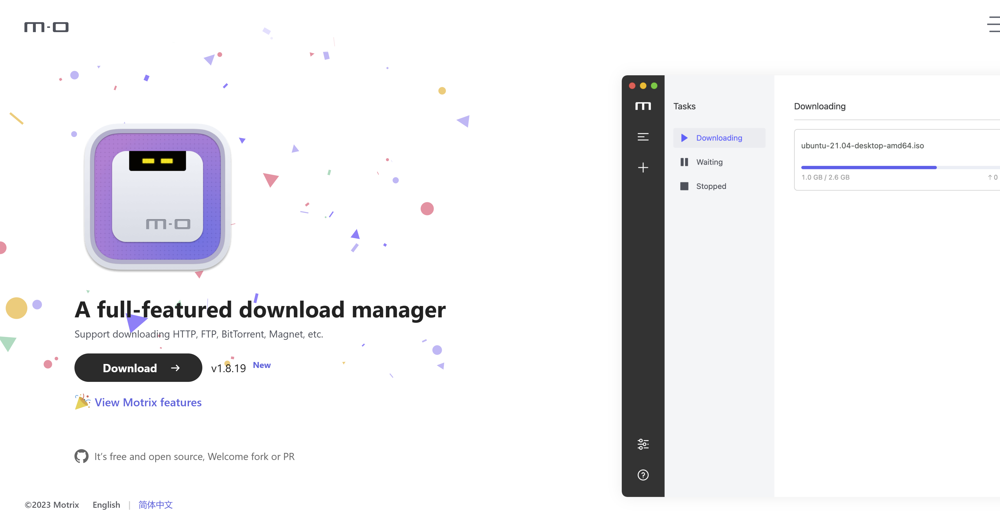
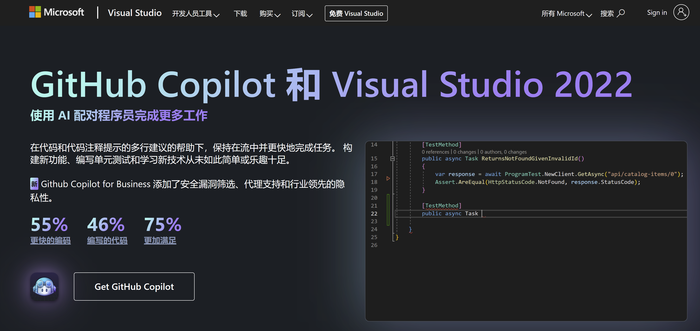
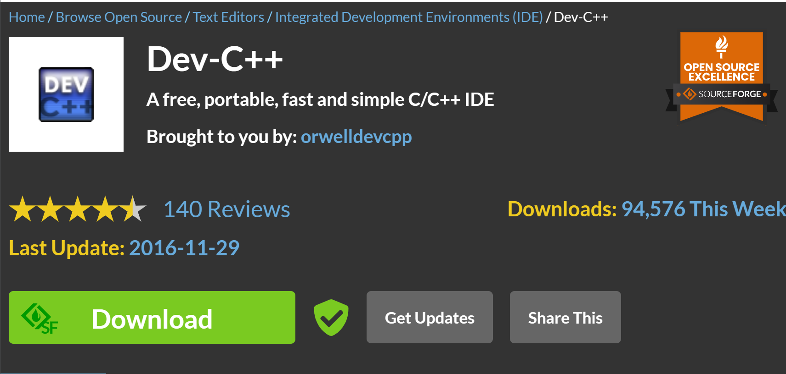
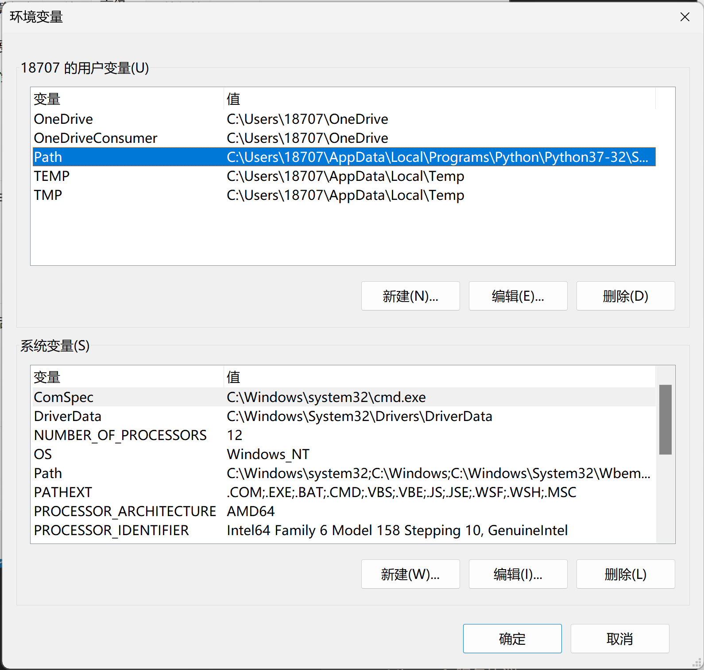
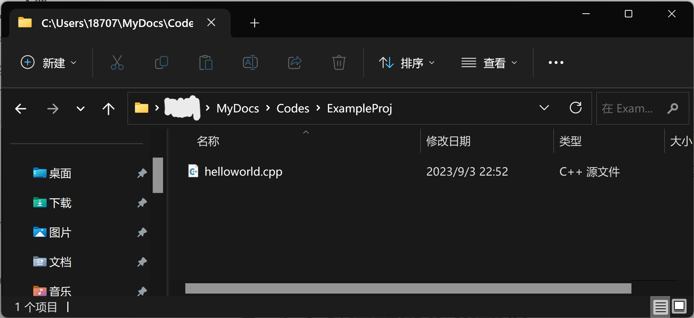
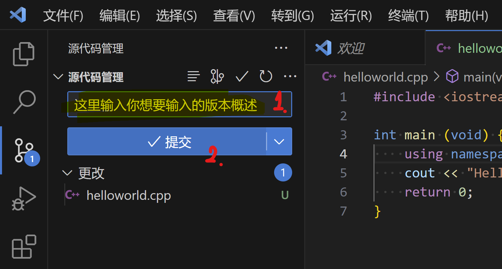
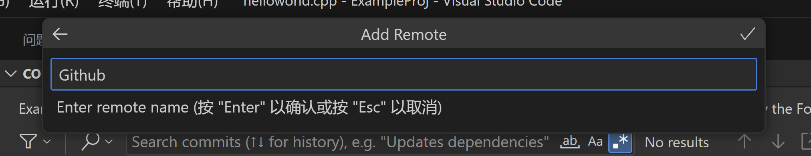
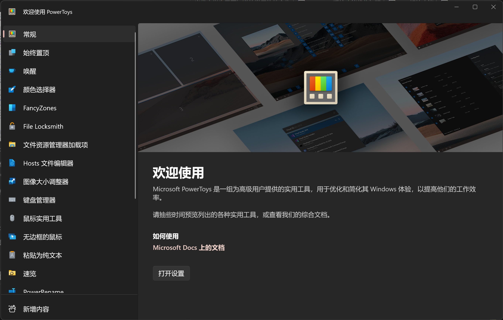

# （也许是）当代大学生需要知道的电脑使用技巧

> **[Update@2023-9-4]**
>
> **观前提示：** 作为作者，我很建议你把这篇文章从头到尾看完,，但是鉴于我还在不定时更新新的内容（具体可以看版本介绍），所以把它当工具书随时查阅也未尝不是一种明智的选择。
>
> **观前提示.II：** 在查看内容时记得留意内容的最新更新时间，有的内容可能过了一段时间后失去了时效性，包括但不限于免费软件转付费软件，有了更优秀的替补，有了新加入的功能等
>
> **观前提示.III：** 作者本人是学电子信息工程专业的，有关计算机方面的知识不能保证完全准确客观完善，如果有建议欢迎写Issue

---

## Part-0 目录

[toc]

---

## Part-1 文件管理和文件搜索

### 文件压缩与解压缩

没用过winRAR，跳过winRAR的介绍环节，没有贬低winRAR收费的意思:)

推荐两个我建议使用的压缩&解压缩软件：

#### **7-zip**


- **官网链接：[7-Zip](https://www.7-zip.org/)**
- **适用平台：Windows**
- **详细介绍：[7-Zip详细安装教程 - 知乎 (zhihu.com)](https://zhuanlan.zhihu.com/p/472315250)**

一个简单轻便的解压软件，具体怎么解压轻便——整个软件都不到2MB了

除了UI有点古朴外没有影响，就讲究一个有口皆碑

#### **bandizip**


- **官网链接：[Bandizip](http://www.bandisoft.com/bandizip/dl/)**
- **适用平台：Windows, MacOS**
- **详细介绍：[Bandzip-让你爱不释手的解压缩软件](https://zhuanlan.zhihu.com/p/65414066)**

我本来是想大力夸赞bandizip的无私的，直到几年前大伙发现在7.0版本开始后bandisoft在bandizip的首页添加了广告（具体参考[别再推荐 bandzip 了！ - 知乎 (zhihu.com)](https://zhuanlan.zhihu.com/p/111170689)）。虽然后来体验一番后发现广告只出现在软件首页，而我一般使用都是只有解压窗口弹出来，具体使用没什么影响，但是心里有点膈应。


为什么顶着广告还要推荐bandizip呢？因为它适配的win11的右键菜单：


很神奇，这种小细节做得很好。

其次就是它的智能解压很符合我的使用习惯，用起来比较舒服。它唯一的问题是配置起来比较繁琐，所以我把我自己的设置导出了一份：

<a href="./README.files/Bandizip Settings - 2023年8月21日.reg">Bandizip Settings.reg</a>

先安装好bandizip（好像得是7.0版本往上），然后关掉程序，双击这个注册表文件，选择写入后再打开bandizip的主页，如果主题变成我设定的灰色就代表设置安装成功了

顺带一提，网上的莫名其妙的注册表文件别瞎安装，真的

### 文件搜索

#### **Everything**

如果你被Windows的**文件资源管理器自带的文件搜索**恶心过，那么，这个软件一定能解决你的问题

如果你没有被恶心过，现在打开文件资源管理器，选中C盘根目录，搜索msedge.exe，你就会理解为什么它恶心了


- **官网链接：[voidtools](https://www.voidtools.com/zh-cn/)**
- **适用平台：Windows**
- **详细介绍：[文件搜索神器 | Everything - 知乎 (zhihu.com)](https://zhuanlan.zhihu.com/p/409431144)**

简单来讲，这个软件提供的是文件搜索功能。在C盘根目录搜索msedge.exe转了几分钟都没反应，但是在everything里，一瞬间就出现了结果


被Windows文件搜索折磨的同学可以尝试

**（建议看完utools和wox的介绍再去下载，因为他们都有everything插件功能）**

在安装完软件之后，记得把自己用不到的文件夹（比如 Windows，AppData，ProgramData，ProgramFiles，Programfiles(x86)） 加入搜索黑名单

### 快速启动

如果你曾使用过Mac，知道`Command+Space`快捷键呼出的**聚焦搜索**功能，那么一定不会对下面这两款软件实现的功能感到陌生——它们都是模拟Mac的聚焦搜索功能推出的，并且都提供了不同的插件安装方式

换一种情况来说，如果你是一个Windows用户，经常用Windows键呼出的主菜单的搜索页面打开应用或寻找文件，那么我也建议你了解一下这几款应用

#### **Wox**


- **官网链接：[Wox](http://www.wox.one/)**   需通过Github下载本体，建议下载前先看看 ***Part-2-3.-从Github上下载软件***
- **适用平台：Windows**
- **详细介绍：[效率神器 — WOX - 知乎 (zhihu.com)](https://zhuanlan.zhihu.com/p/68383315)**

介绍几个我比较喜欢这个软件的地方：


和电脑系统主题自适应的配色和自带的毛玻璃效果


对应的白色主题


也有毛玻璃感更强的主题，总结来说就是比较好看


特有的快速卸载应用插件


Steam游戏快速启动插件（这个utools也有）


以及强迫症最喜欢的每次开启自动回中

#### **Utools**


- **官网链接：[uTools官网 - 新一代效率工具平台](https://u.tools/)**
- **适用平台：Windows, MacOS, Linux**

- **详细介绍：[黑科技神器-uTools - 知乎 (zhihu.com)](https://zhuanlan.zhihu.com/p/113101989)**
- **介绍视频：[uTools的个人空间-uTools个人主页-哔哩哔哩视频 (bilibili.com)](https://space.bilibili.com/395978728)**

对的，这个是国产软件，拥有一些相当本地化的功能，有一些视频处理类插件需要付费，其他插件可以免费使用，但是云同步要开会员

软件的微信公众号里还有他们的开发团队走过五年的心路历程，如果是为了支持国产也可以考虑

这个软件还会占用鼠标中键来实现它的“超级面板”功能，具体使用体验见仁见智吧

说两点我使用过程中感触最深的：


首先，它的文件搜索支持**分类搜索**和**文件预览**。在**文件搜索**上，utools做到了**遥遥领先**

其次，**它不支持自动回中**，也就是你拖动了它的搜索框，它不会自动回到屏幕正中的位置。不是什么大问题，就是强迫症略有一点点难受:)

以及，它的插件真的很多，但是它大肆宣扬的剪贴板插件其实Windows自己有快捷键的，按一下`Win+V`就能调出来

#### **Powertoys**

我把Powertoys放在这里纯属是因为Powertoys Run这个功能不仅难用还把`alt+space`这个快捷键冲了:)，这里不打算详细介绍

Powertoys可以直接在微软应用商店下载，里面有很多功能，但是不建议使用Powertoys Run

> 对于Powertoys的其他功能后文有提及及介绍，具体见 ***Part-4-额外功能-Powertoys***


---

## Part-2 文件上传和文件下载

### 1. 在自己的设备之间传输文件

#### 手机/平板和电脑

如果是国产的安卓（及其类似物）品牌，可以去下载手机品牌对应的电脑软件，

比如小米的 **[小米妙享](https://www.bilibili.com/video/BV1qD4y1B7YJ)**（需要在b站上找机型破解）

华为的 **[华为电脑管家](https://www.bilibili.com/video/BV1S14y1H7hd)**（需要在b站上找机型破解）

oppo的 **[跨屏互联 (oppo.com)](https://connect.oppo.com/zh-CN)**

vivo的 **[vivo办公套件](https://quantumkit.vivo.com/#/)**

荣耀可以用华为的，**magic4系列往后的荣耀手机** 可以用**Windows自带的手机连接**

**三星**……我相信用三星的应该比我这个上一个设备还是s5的人明白三星该怎么用。

苹果的**iPad**可以和同iCloud下的**MacOS设备**使用**Sidecar随航投屏**，文件在iOS/iPad OS与MacOS之间传输可以直接用**Airdrop**，Windows就只能等iCloud同步或者QQ传了

#### 手机和平板/手机

如果你有其他的安卓设备，比如说平板，那么先确认一下自己设备的品牌。

下面的品牌属于**互传联盟**。在互传联盟里的品牌的设备可以通过互传直接传输文件。


然后，华为的**华为分享**没有加入互传联盟，但是和荣耀互通，二者自成一派。

苹果的**Airdrop**只支持苹果生态圈设备，也是自成一派。

如果两个设备正好恰到好处的不能直接互传文件，可以试一下vivo开发的**互传**软件，虽然麻烦了不少，但是还是比插线简单。

长这样↓


### 2. 给别人传输一些文件

有的时候需要给别人传输一些文件，我们一般会有这么几种方式：

#### QQ

一般最简单的发送方式，点对点对话的话离线文件（也就是云端）一天能存2GB；开个临时群聊免费群文件空间是5GB，算是简单好用平时够用的一类

#### 网盘

文件再大一点的话可以走网盘，比如说容量大速度低的**百度网盘**或者容量低不限速的**Onedrive**，适用于较长期的分享处理

#### 快传

有的时候一些短期的文件分享，我会比较建议走快传这条路，比如说我一直在用的这个

- [奶牛快传｜免费大文件传输工具，上传下载不限速 CowTransfer | Unlimited Send Large Files](https://cowtransfer.com/)

云端有10GB的暂存容量，暂存时间最高可以选30天，下载不依赖客户端，可以手机上使用浏览器或者小程序下载，传输几个G的压缩包的时候可以试试

#### 互传联盟/华为分享/Airdrop

参考 ***Part-2-1.*** 的内容

### 3. 从网上下载文件

#### 磁链/种子/https链接

你很有可能需要一些**磁力链接/Bittorrent种子/https链接**下载需求，这是一些软件推荐

##### **Motrix**



- **链接：[Motrix](https://motrix.app/)**
- **适用平台：Windows, MacOS, Linux**

我自己一直在用的一个下载器，基于aria2实现，主要是简单好用***好看***，加上下Github内容下得快

支持https链接下载，磁链下载，迅雷链接下载，种子文件下载，断点续传，功能相对完善

**[Update@2023-8-26]** 

**补充：**  如果想用motrix接管所有浏览器下载的话，Microsoft Edge用户请选择微软插件商店里的[Aria2-Explorer](https://microsoftedge.microsoft.com/addons/detail/aria2-explorer/jjfgljkjddpcpfapejfkelkbjbehagbh?hl=zh-CN)插件或者其他的Aria2插件，那个叫Moxtrix的插件并不能很好的完成功能。

**配置教程：** [Aria2-Explorer - 知乎](https://zhuanlan.zhihu.com/p/387408041)

##### **IDM**


- **官网链接：[Internet Download Manager: The fastest download accelerator](https://www.internetdownloadmanager.com/)** 需要付费
- **适用平台：Windows**

以高性能著称的经典老牌Windows下载器

要钱，但是破解版满天飞

##### **NDM**


- **官网链接：[Neat Download Manager for Mac and Windows (Free Internet Download Manager Mac & Windows )](https://www.neatdownloadmanager.com/index.php/en/)**
- **适用平台：Windows, MacOS**

从名字开始对标IDM的免费下载器，性能很强大（反正我用不完），美中不足的就是UI有点掉价

##### **迅雷**


- **官网地址：[迅雷-构建全球最大的去中心化存储与传输网络 (xunlei.com)](https://www.xunlei.com/)**
- **适用平台：Windows, MacOS, Linux**

老朋友了属于是

国产，但是会和谐资源，下载性能很强大

#### 从Github上下载软件

这里不介绍奇怪的资源网站，需要提一下的就是怎么从Github上下载你想下载的东西

我们以[Motrix](https://motrix.app/)这个项目的[Github页面](https://github.com/agalwood/Motrix)为例：


第一眼看到的这个主页，在最上面一栏的标识上叫Code，也就是源代码，很明显不是我们需要的能跑的软件。如果说得更明白一点，就是这源代码还需要编译才能跑。

所以我们需要下载已经编译好了的版本，也就是release（发行版）。这个词也能在首页很快找到


这里就能看到作者发布的编译好的发行版，左侧是发布时间，右侧是发布的版本号介绍，我们要下载的文件在介绍下面的Assets里


然后就是从这一大摞各个平台的软件里选择出我们这需要的：用的系统是Windows并且是intel或者amd的处理器，找准x86或者x64，然后下载对应exe文件；带Setup的是安装引导，我们明显需要这个。

所以我们最后找准了我们需要的软件


直接单击下载即可；偶尔Github下载网速会很慢，也可以试试加速器或者下载器之类的。


---

## Part-3 写代码前的环境配置

~~首先，前面忘了，中间忘了，不用VSCode的人必将度过一个相对失败的人生~~

写代码的环境配置在两个方面：一个是代码的编写，第二个是代码的编译和运行。这分别对应两个我们应该在意的部分：编辑器和编译器。现在看不懂他们具体是干什么的不要紧，上大学了老师会教，现在我们只需要明白我们怎么安装他。

首先，这里是一串很基础的C语言代码：

```c
#include <stdio.h>
int main(void) {
    printf("Hello, world!\n");
    return 0;
}
```

或者我们整点Python

```python
print("Hello, World!\n")
```

我们将其保存为一个叫做`hw.c`（Python的话就是`hw.py`）的文件，这就是一个源代码文件。**编辑器**就是完成这一个步骤的软件。

然后，我们在命令行里输入以下命令来编译（这里是C，假定编译器是mingw64）：

```powershell
gcc hw.c -o hw.exe
```

对于Python就是

```powershell
python hw.py
```

这个命令让我们用gcc这个程序把我们写的代码翻译成了机器语言，这就是**编译**的过程。完成这个过程的工具叫做**编译器**（对于Python来说这个过程其实是**解释**，所以用的叫Python的**解释器**，在原理上不一样，在这里为了方便就统称编译器了）。

这样就完成了编写一个程序的全部过程。

为了完成这过程，我们有两种选择：

1. 选择**IDE**，也就是**集成编译环境**。这种方式的特点是安装简单，只用点下一步。一般老师上课会有指定的IDE选择。
2. 选择**编辑器**和**编译器**。这种方式主要是有较高的门槛，比如配置环境变量和安装vscode插件等等。这篇文件致力于以每个人都能看懂的方式描述安装过程。

### 选择你的IDE

这里陈列一下市面上比较常用的几款IDE（因为大部分学校都是学C或者Python，很少有Java起步的，所以这边主要介绍C和Python的IDE）

#### **[Visual Studio 2022](https://visualstudio.microsoft.com/zh-hans/)**



- **适用语言：C, C#, .Net, Python, HTML&CSS, JavaScript**
- **开发公司：Microsoft Corp.**
- **适用平台：Windows, MacOS**

由大名鼎鼎的Microsoft公司开发的“宇宙第一IDE”——也不知道是谁先开始这么说的

具有较为稳定的运行表现，可能略有一点复古（相对于VSCode）的外观，scanf有可能会报错的奇怪C语法

之前的卖点是独一份的MSVC(Microsoft Visual C++)编译器和intellisense，现在它乘着GPT-4的东风搞出了Github Copilot，遥遥领先

~~快进到怎么我的代码还没GPT写得好~~

需要注意的是MacOS上的Visual Studio和Windows上的不是一个东西

但凡微软的软件能做得有官网渐变色艺术字一半好看也不至于有人做第三方主题

#### **[CLion](https://www.jetbrains.com/clion/)**


- **适用语言：C, C++**
- **开发公司：JetBrain**
- **适用平台：Windows, MacOS, Linux**

老牌IDE公司推出的老牌C/C++ IDE，不知道在行业内口碑怎么样，但是长得好看，用着好用，当然也不免费

没记错的话用edu邮箱可以弄到免费的来着，可惜我当时初中搞不到

#### **[PyCharm](https://www.jetbrains.com/pycharm/)**


- **适用语言：Python**
- **开发公司：JetBrain**
- **适用平台：Windows, MacOS, Linux**

老牌IDE公司推出的老牌Python IDE，但是这回免费了

C/C++怎么你了JetBrain😡

#### **Python IDLE**


- **适用语言：Python**
- **适用平台：Windows, MacOS, Linux**

没错，就是安装了Python就会安装的那个Python IDLE。谁说这不是一种IDE呢？

至少高中信息课的Python都是在IDLE里写的，说明这个是具有实用性的

#### **Xcode**


- **适用语言：C, C++, Swift, Objective-C etc.**
- **开发公司：Apple Inc.**
- **适用平台：MacOS**

MacOS专用， 苹果亲手操刀，后面的留给果粉去吹，毕竟没怎么用过

在iOS开发和swift变成方面有专攻

苹果用户可以直接在Mac端的App Store里下载

#### **[Code::Blocks](https://www.codeblocks.org/)**


- **适用语言：C, C++**
- **适用平台：Windows, MacOS, Linux**

**高情商：经典老牌IDE	中情商：历史的厚重感	低情商：UI有点复古**

经典老牌IDE了，基本每个C/C++的入门书都会提到Code::Blocks这个软件，拥有相当长的历史

默认好像没有中文汉化，但是用多了就不是问题了

#### **[Eclipse](https://www.eclipse.org/downloads/)**


- **适用语言：C, C++**
- **适用平台：Windows**

（感觉已经说过很多次了）老牌经典IDE，有可能会在你的教科书上出现

~~总感觉我认识Eclipse这个词还是因为"Eclipse first, the rest nowhere."~~

#### **[Dev-C++](https://sourceforge.net/projects/orwelldevcpp/)**



- **适用语言: C, C++**
- **适用平台: Windows**

很老牌的编辑器，有多老呢，上一次提交更新还是2016年

学校需要就用，不需要还是别碰

[一百个你不应该继续用Dev C++的理由 - 知乎](https://blog.csdn.net/qq_40688707/article/details/81137667)

### 安装你的编译器

这里（几乎）不探讨winget安装和choco安装的方法，因为他们面向的用户群体技术力比本文作者还高:)

#### 对于Python

如果你学Python并且用的是Windows系统，你可以直接在微软的应用商店上下载到最新版本的Python

它甚至会帮你加入到环境变量，真的服务贴心，然后你就可以不用看这一小节了

或者你连这都嫌麻烦，就直接在命令行里打这个

```shell
winget install python
```

顺带一提Java好像也能用winget安装

```shell
winget install java
```

至于MacOS，我的建议是上[Welcome to Python.org](https://www.python.org/)下载最新版本安装包，然后一路下一步就好了

至于Linux……你都用Linux了还用看这个？

```shell
apt-get install python
```

#### 对于C/C++

##### 如果你用的是Windows

~~winget亲测没有gcc安装包，所以我们得手动安，白期待了~~

市面上主要的编译器有**Mingw64**，**LLVM Clang**，**MSVC**等。我个人推荐mingw64，所以这里用mingw64的为例

（个人使用的是[Downloads - MinGW-w64](https://www.mingw-w64.org/downloads/)官网上的w64devkit，里面包含mingw64的13.0和其他组件，你要是有别的也可以）


根据引导我们应该能下载到一个叫`w64devkit-1.20.0.zip`的压缩包，我们把它解压成一个文件夹，然后你可以把这个文件夹放在一个你觉得适合长时间存放应用的地方

比如我选了这个位置↓


接下来，复制这个文件夹里的bin的地址，对于我就是`C:\Users\18707\MyDocs\PortableApps\w64devkit-1.20.0\bin`，接下在要做的是把它添加到环境变量里

首先打开设置，然后打开属性


点高级系统设置，然后点环境变量


选中Path（上面的和下面的对于只有一个用户的笔记本没有区别），点编辑，然后新建，然后把复制的路径粘贴进去




然后**一路确定下去**，唤出powershell或者cmd，在命令行界面输入`gcc -v`，不出红字报错就成功了


##### 如果你用的是非M系列处理器的MacOS设备

有一说一我真的很羡慕这种简单的安装方法

1. 首先，在你的软件列表里，打开 **终端(Terminal)** 这个软件
2. 然后，在命令行界面里，输入`gcc`或者`g++`或者`clang`，然后按下回车
3. 然后它应该会有个弹窗弹出来，提醒你安装一个什么开发软件包
4. 你点击安装，进度条走完，一切就神奇地结束了

理论上和你下载苹果的**Xcode**一个效果

##### 如果你用的是M系列的苹果MacOS设备

亲测对于M系列处理器的设备上面的方法无效:)，目前还没搞到可以供我实验的设备

所以复杂一点的方法是和Windows一样去官网上翻自己电脑对应的安装包，记得找Universal版本或者arm64版本的

简单一点的方法是打开你的**App Store**，搜索并下载Xcode，这样就会有附带的clang组件了

我知道你想说什么，这个叫当代买椟还珠

##### 如果你用的是Linux

~~我觉得我没必要写这一条~~

```shell
apt-get install gcc
```

### 安装你的编辑器

这里以VSCode为例，因为我主力使用的还是VSCode

虽然编辑器的作用只是搞文字编辑，但是**代码语法高亮**的语言支持会限制编辑器的兼容性，比如你用Windows自带的notepad可以写全世界任何种类的代码，但是代码的语法高亮一个都不支持。这就是我们选编辑器的原因

#### 安装本体（VSCode）

这里强烈推荐Visual Studio Code，**没有说Atom或者notepad或者Sublime Text不好用的意思**，不过notepad++搞了台独就还真别用了。

首先在微软的官网上下载自己对应版本的VSCode


- **开发公司：Microsoft Corp.**
- **适用平台：Windows, MacOS, Linux**

安装过程一直点下一步就好了，没什么值得注意的。

安装后打开主页面，你会惊讶的发现，这个界面竟然是英文的！先别慌，先认识一下这几个图标。


左边从上到下，依次是文件/文件夹，文件内容搜索替换，Git库管理，debug面板，插件面板。

我建议第一件事是点左下角的人头，登录自己的微软账号打开同步（Turn on Setting Sync）。


#### 安装插件及相关设置（VSCode）

登录完了就可以开始装插件了，这里推荐一些我常用的插件。

##### **Chinese (Simplified)**


简体中文插件，字面意思，把（一部分的）界面语言切换成中文

##### **C/C++ Extension Pack**


C/C++的拓展包，含C/C++，C/C++ Themes，CMake Tools三个插件，基本上必装

##### **C/C++ Snippets**


C/C++的代码模板，提供C/C++插件没提供的一些代码模板

##### **GitLens**


git版本可视化插件，建议先安着，总会用到的

##### **Live Share**


远程召唤一个朋友来替你改代码专用插件Live Share

可能需要自己摸索一下相关的操作，但是使用难度绝对没有你学编程语言高

##### **Prettier**


括号配对着色，可以增强代码可读性

**One Dark Pro**


VSCode上很多人喜欢的第三方主题（为什么啊？）

##### **TabOut**


用Tab键跳出小括号、中括号、大括号、单引号、双引号等成对符号。这个得看个人输入习惯再说用不用（但是我的个人习惯来说这玩意神中神，打败半高方向键的最好方法是放弃半高方向键！）

##### **Markdown相关**


（如果）用VSCode写Markdown时比较好用的几个插件，但是不如直接用Typora或者别的笔记软件


下载了Markdown相关插件的话打开这个选项可以自动在旁边打开文件的渲染结果预览，就像这样👇


如果你不想开，记住手动唤起预览的快捷键是`Ctrl+Shift+V`，然后可以用vscode自带的分屏达到同样的效果

我的建议是，如果可以的话，还是记忆一下常用的快捷键，会很大程度的提高电脑的使用效率

##### **Code Runner**


Code Runner，一个可以让你快速编译并运行你的源代码文件（好像仅限一个文件）的插件，对于初学者很建议使用

使用方式：

- 通过右上角的运行按钮调起code runner


- 或者直接通过快捷键`ctrl+alt+N`达到同样的效果

需要注意的是：


如果你安装了Code Runner，设置里的这三个选项最好打开。至少得把`Run In Terminal`打开，不然你通过code runner运行代码没有办法使用键盘进行输入

##### **其他设置**

> VSCode设置更改的项目在左侧会有黄色的竖线，很容易辨别；并且设置右上角的筛选器里面也可以直接筛选已更改的项目


依照个人需求，看要不要打开VSCode的自动保存功能


包括对于空白字符的显示策略

##### 更进阶的VSCode配置教程补充

> - [VScode安装、配置和使用_vscode的安裝與使用_ISmileLi的博客-CSDN博客](https://blog.csdn.net/toby54king/article/details/105453603)  粗略介绍了VSCode的插件配置，但是详细介绍了VSCode里的断点调试功能的json配置文件，如果需要断点调试（并且不想用VIsual Studio一步到位）的同学可以看一下

#### 其他编辑器推荐

##### **[Sunsetting Atom](https://github.blog/2022-06-08-sunsetting-atom/)**


- **开发公司：Github**
- **适用平台：Windows, MacOS, Linux**

Github是微软的，Atom是Github旗下的，VSCode是Microsoft旗下的，VSCode和Atom都基于Electron框架开发，并且都有差不多的功能，甚至是差不多的主题

🤔🤔🤔🤔🤔

~~虽然Atom的Pre-release说要支持Github Copilot，但是VSCode没理由没有~~

##### **[Sublime Text](https://www.sublimetext.com/)**


- **开发团队：Sublime HQ**
- **适用平台：Windows, MacOS, Linux**

省流：**这个要钱**

和Atom，VSCode齐名的代码编辑器，用不用主要还是看你喜不喜欢各个软件的主题和是不是强需求某个软件的插件

##### **[notepad++](https://notepad-plus-plus.org/downloads/)**


- **适用平台：Windows**

在某种意义上来说，这个软件有情怀加持，因为我初中和小学机房电脑里都装了这个

作者是一个台湾作者，软件遵从GNU的开源协议

然后，在下载使用之前，来看看这个

- [请立即替换掉反华病毒软件Notepad++_哔哩哔哩_bilibili](https://www.bilibili.com/video/BV1dY411D7zW/?spm_id_from=333.337.search-card.all.click&vd_source=fd14097d34912b0fb2bec98bf902b79a)
- [【辟谣】Notepad++真的是反华病毒软件吗？_哔哩哔哩_bilibili](https://www.bilibili.com/video/BV1jT411o7AR/?spm_id_from=333.337.search-card.all.click&vd_source=fd14097d34912b0fb2bec98bf902b79a)

简单来讲，这个作者脑子出了一点问题，导致他在GNU开源协议的基础上搞政治拉踩恶心人，接下来用不用见仁见智

##### **[ndd: notepad--](https://gitee.com/cxasm/notepad--)**


- **适用平台：Windows, MacOS, Linux**

在notepad++事件后中国作者用C++制作的致力于替换notepad++的一款编辑软件，在gitee上开源，支持多平台

主要还是看UI和插件

##### **notepad**

- **适用平台：Windows**

没错，就是Windows自带的记事本

### 关于Git的入门

> **[Update@2023-9-4]**
>
> **观前提示：** 手把手教学，治标不治本，如果有希望进阶学习的同学（比如说计算机学院的），可以去看看git官方的[Git - Book](https://git-scm.com/book/zh/v2)。顺带一提，Git-Book很贴心的提供了中文版本，所以不用担心看不懂。

首先，这个教学的目的是让你的项目连接到远程的git代理库（比如GitHub），我们先明确这一点。

然后先进行准备工作吧

#### 本地准备工作

> **观前提示：** Git的本体基本上是必选项，命令行能提供最多样的命令选择；Git的GUI软件其实是可选项，这也是我图好看的主要原因
>
> 顺带一提安装Git顺带安装的Git GUI那个软件是真的不好用，当然也不排除是我的问题
>
> **观前提示：** 如果**你选择使用命令行进行git操作**，请**跳过后面通过Git的GUI页面的全部教程**，跳转至 ***如果你选择使用命令行*** 章节

##### **Git（本体）**

我们先安装我们的主角[Git](https://git-scm.com/downloads)


- **适用平台：Windows, Linux, MacOS**
- **官网网址：[Git - Downloads (git-scm.com)](https://git-scm.com/downloads)**

目前使用最为广泛的代码版本管理软件，可以通过SSL连接多个远程托管服务器，比如说Github，Gitee（国内的，中文名叫码云），Gitlab等，基本写代码都要用的吧……不是很确定

Git可以全程通过命令行操作，但是也有很多直观的GUI版本可以使用，但是通常GUI都会缺少一些功能，所以两者基本都会用到

> 关于Git的GUI软件，Git的官网[Git - GUI Clients (git-scm.com)](https://git-scm.com/downloads/guis)上有非常详细的介绍，你可以在上面选符合你的审美的或者你觉得价格合适的之类的，应该是会不断更新的，如果你选好了就不用往下看了，下面都是我列的我自己喜欢的Git GUI

##### **Vscode的GitLens插件**

受到微软官方认可的Git插件，功能比较强大，可以等效为Git的GUI软件进行使用

在安装的时候图标长这个样子：


能在微软官方Vscode支持的基础上提供版本树的图形化表示，GUI涵盖了一部分的内容，但是有的时候使用Push不是很方便

具体的界面如下：


##### **Fork**


- **适用平台：Windows, MacOS**
- **官网链接：[Fork - a fast and friendly git client for Mac and Windows (git-fork.com)](https://git-fork.com/)**

在三年前这是我心目中最好用的Git的GUI客户端，不仅好看，免费，并且还功能完善，操作清晰，色调明快，满足基本所有的功能，唯一的缺点是不支持中文

现在的问题是这个收费了，$49.99，高攀不起

如果我之后写Markdown入门介绍的话你会在我对Typora的描述里看到相似的言论

##### **Github Desktop**


- **适用平台：Windows, MacOS**
- **官网链接：[GitHub Desktop | Simple collaboration from your desktop](https://desktop.github.com/)**


我觉得最大的缺点是它没有版本树的可视化功能，但是它有Github冠名

##### **Sourcetree**


- **适用平台：Windows, MacOS**
- **官网链接：[Sourcetree | Free Git GUI for Mac and Windows (sourcetreeapp.com)](https://www.sourcetreeapp.com/)**

好看，但是没有fork好看，但是**免费**

##### **Gitkraken**


- **适用平台：Windows, MacOS, Linux**
- **官网链接：[GitKraken Legendary Git Tools | GitKraken](https://www.gitkraken.com/)**

~~它说自己most powerful真的不会触犯广告法吗~~

👆Vscode的Gitlens插件是GitKraken做的，我为我的无知感到抱歉，它确实强


它有写free，应该是能免费用的

#### 远程准备工作

现在你要选择一个你比较喜欢的代码托管网站，然后按照引导注册一个账号，记住你的账号和你的密码

##### **Gitee（码云）**


- **官网：[Gitee - 企业级 DevOps 研发效能平台](https://gitee.com/)**
- **优点：** 服务器建设在国内，连接顺畅并且速度较快，页面是中文容易上手，免费
- **缺点：** 建立项目默认是私有项目，想转公共项目需要审核内容，像我这个文件就不知道为什么审核没过没法显示，属于是国内特色

##### **Gitlab**


- **官网：[The DevSecOps Platform | GitLab](https://about.gitlab.com/)**
- **优点：** 国内直连比Github稳定太多，免费，没有审核
- **缺点：** ~~我其实不太确定~~全英文~~算不算缺点~~，有的时候略卡

##### **Github**


- **官网：[github.com](https://github.com/)**
- **优点：** 背靠Microsoft，是全世界最大的代码托管网站，认可度最高，理论上最好使
- **缺点：** 有的时候登录巨慢，**有的时候压根没法链接**（亲测华科校园网连的最快），上去下个文件还得用motrix等下载工具才能跑到MB/s级别

#### 本地git配置

首先讲一下Git下载下来安装包后具体的安装过程

> **注：** 因为我电脑上已经安装好了git，卸载再安装会比较繁琐，有一些图片和资料引用自CSDN的[Git 详细安装教程（详解 Git 安装过程的每一个步骤）_git安装-CSDN博客](https://blog.csdn.net/mukes/article/details/115693833)
>
> **注.II：** [Git 详细安装教程（详解 Git 安装过程的每一个步骤）_git安装-CSDN博客](https://blog.csdn.net/mukes/article/details/115693833) 里面介绍得非常详细，建议大家直接观看该教程，我没办法写得比它还细了

唯一一点值得补充的，就是Git安装时编辑器的部分，不一定非要用vim或者他说的notepad++，实际上你甚至可以使用VSCode作为你的编辑器

但是如果是纯命令行操作的话，你估计还得用vim或者emacs了

---

安装完git后，打开你的**终端**（也就是命令行，你用**cmd**，**powershell**都行），然后进行git的全局设置

> \# 后面是注释，可以不用输入注释的内容

```shell
git config --global user.name "YourName" # 记得把双引号里的内容换成自己的名字
git config --global user.email "YourEmail" # 记得把双引号里的内容换成自己的邮箱
```

如果输入格式错误命令行会报错，如果输入正确那么命令行**只会卡一下，不会有输出**，还请注意

这个是更改git的全局设置（如果你有用Git GUI的话有的会引导你进行这一步，比如说Fork就会），所有设置会存储在一个叫`.gitconfig`的文件里，具体的文件路径是`"C:\Users\你的用户名\.gitconfig"`


> 如果**你选择使用命令行进行git操作**，请**跳过后面通过Git的GUI页面的全部教程**，跳转至 ***如果你选择使用命令行*** 章节

#### 远程代码仓库配置

> **P.S.** 这里通过Github进行演示，其他代码托管网站应该大同小异
>
> **P.S.2** Gitee默认是私有库，如果要转换成所有人可见需要自己去设置里调，并且会有审核

首先，我们在Github页面上新建一个代码库，代码库的名字可以随便取，你乐意取什么都行，**没有必要和本地的项目文件夹名字一致**


然后我们应该会进入这个页面：


> Gtihub已经贴心的帮你把需要的所有的命令行指令都打出来了，别的代码托管网站可能也有类似的功能，我这边后续GUI还是基于VSCode的GitLens插件进行操作

然后，你复制好你的这个远程库的链接。有两个途径可以看到这个链接

要么是你的页面给你的：


要么是直接在你的地址栏里面：


总之先复制这个链接，这样远程仓库就准备完毕了

#### 如果你选择使用GUI

> **观前提示：** 之后的操作基于Vscode及其GitLens插件实现，用其他的Git GUI可能操作略有不同

##### 本地代码仓库配置

然后进入你的代码项目文件夹，比如说我就使用这个



虽然可以直接用命令行进行`git init`操作，但是得先使用`cd`命令，所以我的建议是**直接用VSCode打开这个文件夹**，然后使用VSCode的初始化代码库：


这样就初始化了这个代码仓库（本地），我们先推送它的第一个版本：



然后打开GiLens插件的可视化，我们就能看到我们的版本推送了：


这样，我们就完成了本地的代码仓库配置

##### 连接远程和本地仓库

回到我们的VSCode页面，这次是用的不是GitLens插件了，而是它自带的Git功能


然后会弹出一个弹窗，在这个弹窗里填写你对这个代码托管网站的别名

> 用Github托管代码，别名不一定要写Github，~~只要你自己能看懂~~随便你写什么都行，没有硬性要求



然后接着按照提示粘贴进去你刚刚复制的代码库的地址：


然后按`Enter`键进行确认，它应该会尝试连接远程代码仓库，并且可能会让你输入你的账号和密码

如果连接成功了，就会出现这个样子：


> 👆这个人脑子不清醒把Github输入成Gtihub了🙃

介绍一下Git的三个基本功能：**Push（将本地的版本推送到托管服务器）**，**Pull（将托管服务器的版本下载到本地且直接合并）**，**Fetch（同步信息，不进行合并）**。如果你只是一个人使用，在远程代码仓库里没有更改的话，应该只会使用到**Push**功能，毕竟也没必要**Pull**或者**Fetch**

在VSCode，**Push**常用的方法有两种：

- 其一：用`ctrl+shift+P`快捷键（或者`ctrl+P`后自己在框里打个`>`）调出VSCode的快捷指令界面，然后找到`Git: Push To`命令，然后推送到你想推送到的库


- 其二：在你已经**Push**过一次了之后，GitLens的页面里会自动提醒你**Push**，非常的贴心


##### 之后的版本提交

首先，你在更改并保存完文件后，先进行本地版本的提交，就像这个图：


成功提交版本后，通过 ***连接远程和本地仓库*** 里提到的**push**操作将本地的版本提交到远程代码仓库就完成了一次从本地到云端的提交

#### 如果你选择使用命令行

首先，因为我不确定你们的项目地址，所以我们来约定一系列的替换用词：

- **<u>%本地项目%</u>** 来代指你的项目的本地地址，注意是**绝对地址**，这个可以在文件夹的**属性**里查到
- **<u>%远程仓库%</u>** 来代指你的项目的远程地址，注意是http或者https开头的链接，这个可以在 ***远程代码仓库配置*** 里看到相关内容

> **注意：** 为了更好地理解，**可能**需要你有命令行的命令的基础（有`cd`就够）
>
> **注意：** 关于`git clone`之类的操作可能需要看其他的教程

打开你的命令行，对于Windows就是**终端**，**Powershell**或者**cmd**，对于MacOS就是**Terminal**

然后，在你的命令行里进行操作：**（#后面的是注释，不用打进去）**

##### 初始化本地代码仓库

```shell
# Step-1 移动到项目路径 
cd %本地项目%
# Step-2 初始化
git init
```

##### 提交本地版本

```shell
# Step-1 把所有文件加入待提交清单
git add .
# Step-1-optional 把文件名加入追踪，一般不使用，这里你可以跳过这个命令
git add <文件名>
# Step-2 提交版本，注释里可以写想写的内容，可以看GUI版本的对应操作进行理解
git commit -m "注释"
```

##### 连接远程代码仓库

``` shell
# Step-1 别名随便写，你看得懂就行；理论上要登录账号，建议看情况操作
git remote add <远程仓库别名> %远程仓库%
# Step-2-optional 把目前的分支改名为main（因为Github默认是main，而有的默认是master），这个是可选项，也就是看你自己的习惯和选择的代码托管平台
git branch -M main
# Step-2 如果没有改名的话main可能要改成master或者其他的；这个就是我们说的push操作，把本地的文件推送的远程代码仓库上
git push -u <远程仓库别名> main
```

##### 之后的版本提交

```shell
# Step-1 把所有文件加入待提交清单
git	add .
# Step-1-optional 把文件名加入追踪，一般不使用，这里你可以跳过这个命令
git add <文件名>
# Step-2 提交版本，注释里可以写想写的内容，可以看GUI版本的对应操作进行理解
git commit -m "注释"
# Step-3 如果没有改名的话main可能要改成master或者其他的；这个就是我们说的push操作，把本地的文件推送的远程代码仓库上
git push -u <远程仓库别名> main 	 
```

#### 更进阶的Git教程补充

这些基本就是Git的基础入门操作了，更进阶一点的~~入门操作~~可以通过百度搜索来学到更多

> **知其所以然的教程推荐：**
>
> - [Git 教程 | 菜鸟教程 (runoob.com)](https://www.runoob.com/git/git-tutorial.html)
> - [Git【入门】这一篇就够了 - 知乎 (zhihu.com)](https://zhuanlan.zhihu.com/p/150837682)
> - [Git使用教程,最详细，最傻瓜，最浅显，真正手把手教 - 知乎 (zhihu.com)](https://zhuanlan.zhihu.com/p/30044692)
> - [猴子都能懂的GIT入门 | 贝格乐（Backlog）](https://backlog.com/git-tutorial/cn/)


---

## Part-4 系统功能优化及加强

> 严格意义上来讲 ***Part-1*** 的内容是 ***Part-4*** 的子集，但是 ***Part-1*** 写的时候我还没构思到 ***Part-4***，这下回旋镖打到我自己了
>
> 所以，在看 ***Part-4*** 之前，还是建议把 ***Part-1*** 看一下，我也会尽量在 ***Part-1*** 和 ***Part-4***  之间添加一些双向索引来达到不同Part相互关联的效果

### 额外功能

#### **Powertoys**



- **开发公司：Microsoft Corp.**
- **适用平台：Windows**
- **下载方式：微软应用商店**

微软官方开发的power命名的软件工具，里面有一些你可能会用到的内容，比如


👆你可能会需要的Windows快捷键指南


👆这个适合在网课时候用，可惜现在没网课了


可以考虑下一个，给自己增加一点电脑使用需求

#### **Quicklook**


- **开发团队：Paddy Xu**
- **适用平台：Windows**
- **下载方式：微软应用商店**

主要功能是快速预览，占用的快捷键是单个`space`键，而作为对照Powertoys的快捷键是`Ctrl+Space`

不自带Office文档预览功能，需要在[Github页面](https://github.com/QL-Win/QuickLook/wiki/Available-Plugins)上下载对应的插件。


插件的功能很丰富，包括但不限于Font文件预览，epub文件预览，office文件预览，BT种子文件预览，文件夹预览，Xmind文件预览等，可能涵盖一些Powertoys里的“速览”功能没有的文件格式。

 **[Update@2023-9-5]** 

Quicklook的预览支持薄纱Powertoys，不建议任何人使用Powertoys的“速览”功能

### 功能优化

#### **腾讯桌面管理**


- **官网链接：[桌面整理_桌面整理软件_一键桌面整理工具-腾讯电脑管家官网 (qq.com)](https://guanjia.qq.com/product/zmzl/)**
- **适用平台：Windows**

我的评价是，先别对着腾讯这个名字PTSD了，这个软件是真的挺好的，功能晚上，界面美光，**甚至没有广告**！

腾讯做良心软件，不觉得很酷吗，作为一个大学生我觉得太酷了，很符合我对未来科技的想象，科技并带着趣味

不过需要注意的是，那个超级大的 <u>*立即下载*</u> 按钮下载的是腾讯管家全家桶，**只有下面这行小字才是单纯单独这个功能**


软件具体的功能就是在桌面上创建这个样子的半透明小格子用于文件分类，支持毛玻璃效果，兼容WallPaper Engine，并且支持文件夹映射（也就是你可以在桌面直接显示别的文件夹的内容），功能我觉得是足够强大的，至少比国外的付费竞品要强

#### **Geek**


- **官网链接：[Geek Uninstaller](http://www.geekuninstaller.com/)**
- **适用平台：Windows**
- **详细介绍：[卸载神器 | Geek Uninstaller - 知乎](https://zhuanlan.zhihu.com/p/119458886)**

如果担心注册表或者文件夹残留的话可以用geek来卸载对应软件

需要注意的是软件只有Portable（也就是免安装）版本，想要用utools或者wox快速打开的话需要把快捷方式加入到Windows启动菜单

**教程就在本节后面一点**

#### **Wox的Quick Uninstaller插件**

> 关于Wox，前文提及且有详细介绍，见 ***Part-1-快速启动-Wox***

如果你选择使用Wox，那么安装方法很简单：在Wox的输入框里输入

```shell
wpm install quick uninstaller
```

有了这个插件的好处在于。如果用的是Windows默认的卸载方式，偶尔会跳转到控制面板再找一次你要卸载的软件；但是有了quick uninstaller，你就只用


一步到位

同理，可以用`wpm`插件安装[Wox官网的插件一览](http://www.wox.one/plugin)上的各种插件，我个人最推荐的还是`steam`、`Quick Uninstaller`和`有道翻译`

#### Everything


- **官网链接：[voidtools](https://www.voidtools.com/zh-cn/)**
- **适用平台：Windows**
- **详细介绍：[文件搜索神器 | Everything - 知乎 (zhihu.com)](https://zhuanlan.zhihu.com/p/409431144)**

> 前文提及且有详细介绍，见 ***Part-1-文件搜索-Everything***

### 把免安装软件加入启动菜单

我们先把好处说了吧：加入开始菜单后你可以从开始菜单，utools或者wox里快速启动这个软件

---

首先，我们先要知道，你的开始菜单本质是这个文件夹里的快捷方式

(虽然看起来比较抽象，但是你直接复制在文件管理器的路径里就能跳转)

```
%ProgramData%\Microsoft\Windows\Start Menu\Programs
```

或

```
%AppData%\Microsoft\Windows\Start Menu\Programs
```

所以，你先把你需要用的免安装软件放在一个比较顺眼的位置

然后创建一个快捷方式移动到我们说的开始菜单文件夹里面。有一个简便一点的方式，就是按住键盘上的`alt`键不放，然后把exe文件拖到开始菜单里面，这样它自动创建的就是快捷方式

👆顺带一提，如果不按住修饰键就是移动，按住`alt`就是创建快捷方式，按住`ctrl`就是复制，具体的见 ***Part-5***


---

## Part-5 系统常用快捷键整理

### 与鼠标协同的快捷键

在使用电脑的过程中，大多数时候用的还是鼠标，所以先盘点一下与鼠标协同的快捷键。

#### 选择项目

假如我们有这么一个场景：


我们选择了第一个文件，如果不按修饰键（实际上，按住`alt`也一样），就是这个样子：


接下来是一点不一样的，按住`ctrl`键再点击别的文件，相当于添加选择（或者取消已经选择的）文件：


所以，就可以达到这样的效果：


而与之不同的是，如果你按住`shift`修饰键，则是选择两次点击之间的所有文件：


需要提醒的是，一般快捷键是具有泛用性的，也就是说在不同的软件里面，有的快捷键的效果可能有相同的定义，我就以这个鼠标修饰键为例：

- 在浏览器里，按住`ctrl`也会有网页多选的效果：


- 同理，在浏览器里，按住`shift`也会有范围选择的效果：


同理，在Photoshop（或者Affinity Photo）的对象/图层选择，Premiere Pro的轨道/素材库里的素材多选之类的也有相同的逻辑

浏览器多选网页可以配合其他浏览器快捷键使用，这个会放在后面进行介绍

#### 文件的拖动

众所周知，我们直接在文件夹之间拖动文件是这个效果：文件的移动


（当然，如果是从外部存储设备往内部存储拖动文件的话默认是复制，我们这里先不计较这些细节）

但是，如果有了修饰键，结果会有改变（在这里`shift`修饰键没有实际作用）

如果按住了`ctrl`，那么文件的移动操作会变成文件的复制操作：


如果按住了`alt`，那么文件的移动操作会变成在指定目录创建选中文件的快捷方式：


【尚未完结 TODO】
